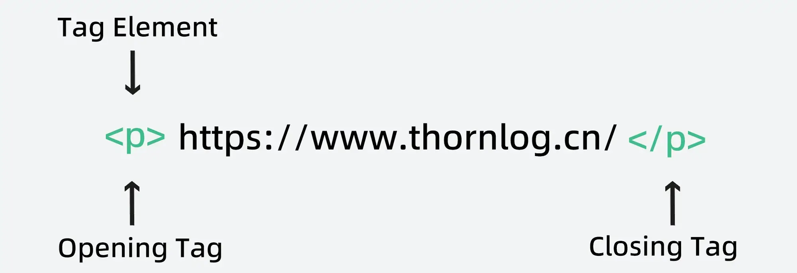
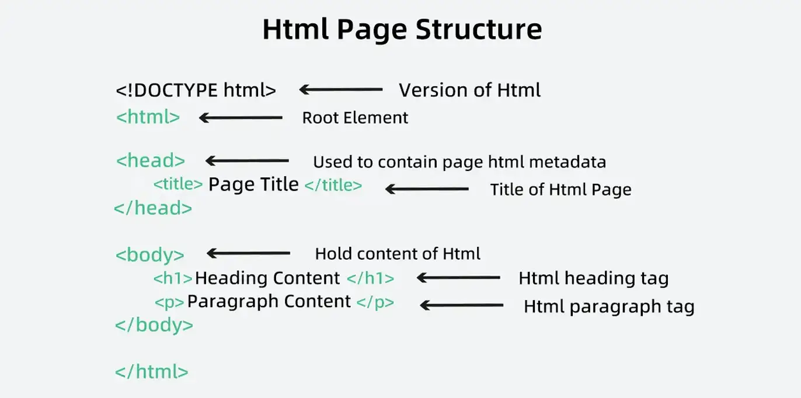

HTML，即**超文本标记语言**，是创建网页的标准语言，由 [Tim Berners-Lee](https://en.wikipedia.org/wiki/Tim_Berners-Lee) 爵士于1991年首次推出，标志着万维网的诞生。最初的HTML版本（HTML 1.0）非常简单，主要用于文本格式化和链接创建。

随着时间的推移，HTML不断发展，新增了更多标签和功能。其中，HTML5是最新版本，于2014年发布，拥有广泛的特性和功能，包括对多媒体、移动设备和语义标记的支持。

如今，HTML已成为Web的基础，全球数以百万计的开发人员和设计人员使用它来构建网站、Web应用程序和其他数字内容。

## 元素和标签

HTML由元素和标签组成，元素是构建网页内容的基本单元，可以包含文本、图像和视频等不同类型的内容。标签用于定义元素的类型和属性。

HTML中有许多不同类型的元素和标签，每个[元素](https://webtutor.dev/html/html-elements)和[标签](https://webtutor.dev/html/html-html-tag)都有其特定的功能和属性。一些常见的元素和标签包括[标题](https://webtutor.dev/html/html-heading)、段落、链接、[图像](https://webtutor.dev/html/html-images)、表单和表格等。

通过使用适当的元素和标签，开发人员可以创建既有吸引力又具有功能性的动态网页。



## HTML 页面的结构是什么？

HTML 页面由多个部分组成，包括 doctype 声明、head 部分和 body 部分。

`<DOCTYPE！HTML>`

doctype 声明是 HTML 文档的第一行，它告诉浏览器页面是用哪个版本的 HTML 编写的。

`<HTML>`
这称为 HTML 根元素。它包含所有其他元素。

`<Head>`接下来


是 head 部分，其中包含有关页面的元数据，例如标题、作者以及指向外部样式表或脚本的链接。

`<正文>`
正文部分包含页面的实际内容，例如文本、图像和视频。此部分是编写大多数 HTML 代码的地方。

HTML 代码由一系列标签组成，这些标签定义了页面的结构和内容。例如，标记用于指示标题，而``<p>``用于指示文本段落。

总的来说，HTML 页面的结构相对简单，但可以使用 [CSS ](https://webtutor.dev/css/css-introduction)和 [JavaScript ](https://webtutor.dev/js/js-introduction)进行自定义和增强，以创建更复杂和交互式的网页。



任何文本编辑器都可用于创建 HTML 文档。保存扩展名为**.html or.htm**的文本文件。保存为 HTML 文档后，该文件可以在浏览器中作为网页打开。

记事本 （Windows） 和文本编辑 （Mac） 是两个基本/内置文本编辑器 （Mac）。当您刚刚开始时，基本的文本编辑器就足够了。随着您的进步，许多功能丰富的文本编辑器将变得可用，从而实现更大的功能和灵活性。

### Example

```html
<!DOCTYPE html>
<html>
<head> 
  <title>Webtutor.dev</title>
</head>
<body>
  <h1>Welcome to Webtutor.dev</h1>
  <p>We are here to Build Websites.</p>
</body>
</html>
```

## HTML的特点

- 它易于学习和使用。
- 它与平台无关。
- 网页可以包含图像、视频和音频。
- 文本可以用超文本进行补充。
- 它是一种标记语言。

## 一些基本标签

`<!-- Comments here -->`：注释标签在 HTML 代码中用于插入注释，帮助我们理解复杂的代码并排除故障。

`<p>`：段落标签，自动在任何段落之前和之后添加空格，这本质上是浏览器边距。

-  `align` 属性已被弃用，请不要使用。
- 某些标签（例如`<div>`标签是块级元素，不能嵌套在 `<P>`标签中。

`<br>`：可用于告诉 HTML 浏览器应该在何处修改行。此标记没有结束标记。

`<pre>`：表示预定义格式文本。在该元素中的文本通常按照原文件中的编排，能保留 HTML 内容中的空格和换行符。

`<b>`：可用于使文本加粗或粗，在样式上对文本应用粗体格式，标签中同时使用开始和结束标签。

`<strong>`：强调文本的语义相关性，对重要性较强的文本使用，同时使用开始和结束标签。

`<i>`：只是斜体文本，而不为内容提供任何语义值。

`<em>`：将文本标记为强调（emphasis）格式。可嵌套，嵌套层次越深，则强调的程度越深。

`<mark>`：可用于突出显示 HTML 中的文本。它有一个开始标签和一个结束标签。

`<sub>`：下标文本显示在标准行下方半个字符处，偶尔以较小的字体显示。

`<sup>`：上标文本比标准行高出半个字符，偶尔会以较小的字体显示。

`<small>`：元素用于减小文本的大小。必须呈现较小的文本应用和标记括起来。

`<del>`：该元素用于通过删除文本部分来擦除文本部分。它还具有开始和结束标签。

`<ins>`：定义已经被插入文档中的文本。

## 附录

- [MDN Web Docs (mozilla.org)](https://developer.mozilla.org/zh-CN/)
- [Chrome 开发者指南](https://web.dev/about?hl=zh-cn)
- [Web Tutor 在线教程](https://webtutor.dev/)
- [HTML Tutorials | HTML Dog](https://htmldog.com/guides/html/)
- [HTML Tutorial (w3schools.com)](https://www.w3schools.com/html/default.asp)
- [w3school 在线教程](https://www.w3school.com.cn/)
- [菜鸟教程 (runoob.com)](https://www.runoob.com/)
- [百度前端技术学园 (baidu.com)](https://ife.baidu.com/)

