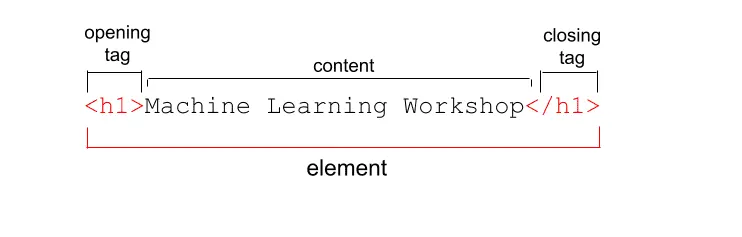
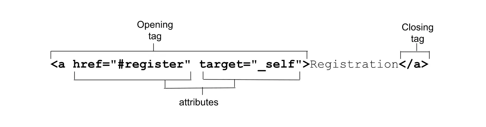
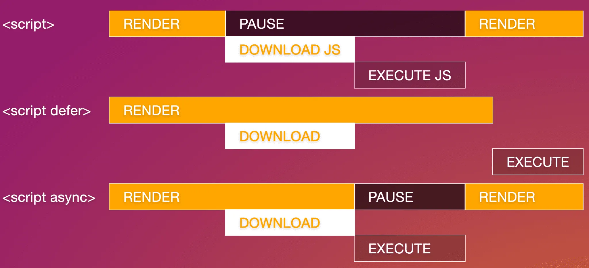
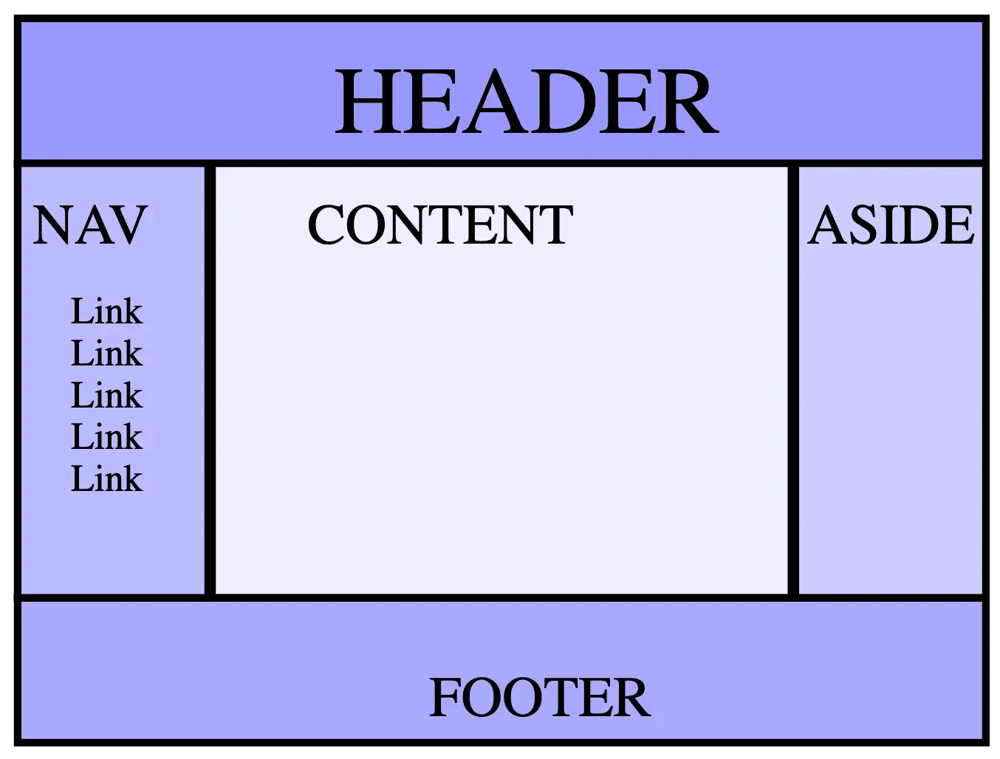

HTML是Web上描述文档结构的标准标记语言，由一系列元素和属性组成。HTML文档形成节点树，包含元素和文本节点。元素为文档提供语义和格式，如段落、列表、表格、图片和表单控件。每个元素可指定多个属性，可以包含其他元素和文本。<!--more-->元素分为多种类别，如元数据、版块、文本、内嵌语义、表单、互动、媒体、组件和脚本。本系列视频将介绍其中大部分类别的内容。首先，我们先来了解什么是元素？

## Html 元素

HTML由一系列元素组成，用于封装不同部分的内容，以便以特定方式显示或运行。HTML元素由尖括号（`<`和`>`）标记分隔。

例如，网页标题作为一级标题使用`<h1>`标记表示。在这个例子中，“机器学习研讨会”是标题的内容，位于开始标记和结束标记之间。整个元素（包括起始标记、内容和结束标记）构成了该元素。结束标记与起始标记相同，但前面带有一个斜线。



虽然许多人混用“元素”和“标记”这两个术语，但它们并不完全相同。标记名称是尖括号中的内容，如`<h1>`。而“元素”包括起始标记、结束标记和这些标记之间的所有内容，包括嵌套元素。

## Html 属性

起始标记中的 `` 和 `<input>` 示例包含元素类型和额外的属性，这些属性是用空格分隔的名称/值对，有时可以选择添加值。属性是 HTML 的一个强大特性。虽然我们的系列中会介绍数百个属性和属性值，但在这里，我们只讨论一般属性及其添加方法。

属性提供了元素的相关信息。与起始标记的其他部分一样，这些属性不会出现在内容中，但它们有助于确定内容对于视力正常的用户和非视力用户（使用辅助技术和搜索引擎的用户）的显示方式。

属性仅显示在起始标记中，该标记始终以元素类型开头。类型后可以跟零个或多个属性，属性之间可以用一个或多个空格分隔。大多数属性名称后跟一个等号，等号后是属性值，用双引号括起来。



在这个示例中，我们有一个带有两个属性的锚链接，将“Registration”（注册）内容转换为内部锚链接。当用户激活该链接时，页面会滚动到具有 `id="register"` 属性的位置。

属性定义了元素的行为、关联和功能。我们将在本系列的[属性](https://web.dev/learn/html/attributes?hl=zh-cn)部分介绍更多属性。有些属性可以出现在任何元素的开始标记中，有些仅适用于特定元素，而有些只适用于单个元素。

大多数属性是名称/值对。布尔值属性可以只作为属性出现，而不需要额外的值。

## 本节总结

1. **HTML概述**：HTML是一种标准标记语言，用于描述Web文档结构。它通过一系列元素和属性来组织文档，为文档提供了语义和结构。
2. **HTML元素和节点**：HTML文档以节点树形式存在，包括元素节点和文本节点。元素是文档的基本构建块，用于组织内容，并且可以包含属性和其他元素。
3. **元素的分类**：HTML元素根据其功能和语义分为多种类别，包括元数据、版块、文本、内嵌语义、表单、互动、媒体、组件和脚本。
4. **元素的结构**：HTML元素由起始标记、结束标记和内容组成，正确的嵌套对于确保文档结构的完整性至关重要。
5. **元素的替换和属性**：HTML元素分为被替换和未替换两种类型，其中被替换元素会被系统替换为对象。属性为元素提供相关信息，应当合理使用以确保文档的正确呈现。
6. **元素的外观和语义**：HTML元素的外观由用户代理样式表设置，但应注意元素的语义对于辅助技术和搜索引擎非常重要。
7. **文档对象模型（DOM）**：HTML文档结构和内容的数据表示由文档对象模型（DOM）提供，通过DOM可以访问和控制HTML元素的功能。

这些要点全面介绍了HTML的基本结构、元素分类、元素特性以及与DOM相关的概念，为深入理解HTML的工作原理奠定了基础。

## Html 文档结构

HTML 文档的关键要素包括文档类型声明和根元素 `<html>`。根元素内嵌文档标头和正文，其中包含着重要的元信息，如搜索引擎和社交媒体结果、浏览器标签页图标等。虽然这些内容对于正常访问者是不可见的，但它们对网站的功能至关重要，几乎会出现在每个网页上。

要创建 MachineLearningWorkshop.com（MLW）网站，必须在每个网页中添加必要的要素，如文档类型、语言和字符集声明，以及网站标题或名称。

## Html 必需元素

某些功能对于任何网页来说都是绝对必要的。即使在没有这些元素的情况下，浏览器也会呈现内容，但它们仍然是不可或缺的。

### !DOCTYPE html

在任何 HTML 文档中，第一项内容都是序言。对于 HTML，只需提供 `<!DOCTYPE html>`。尽管它看起来像是 HTML 元素，但实际上它是一个名为“doctype”的特殊节点。doctype 告诉浏览器使用标准模式。省略此项会导致浏览器使用不同的呈现模式，称为“怪异模式”。添加 doctype 有助于防止怪异模式的出现。

### html

`<html>` 元素是 HTML 文档的根元素。它是 `<head>` 和 `<body>` 的父级，包含 HTML 文档中除 DOCTYPE 之外的所有内容。尽管可以省略，但请务必包含它，因为这是声明文档内容语言的元素。

### 内容语言

添加到 `<html>` 标记的 `lang` 语言属性用于定义文档的主要语言。语言属性的值是两个或三个字母的 ISO 语言代码，后跟区域。虽然区域是可选项，但建议提供，因为不同区域的语言可能有很大的差异。此语言声明使屏幕阅读器、搜索引擎和翻译服务能够识别文档的语言。除了在 `<html>` 标记中设置文档的语言，还可以在文档中标识主要语言的例外情况。这样做不会影响视觉效果，但会增加语义，使辅助技术和自动化服务能够了解受影响内容的语言。

## Head 必需组件

文档元数据（包括文档标题、字符集、视口设置、说明、基准网址、样式表链接和图标）位于 `<head>` 元素中。尽管您可能不需要全部这些功能，但请始终添加字符集、标题和视口设置。

### Head 字符编码

在 `<head>` 中的第一个元素应该是 `charset` 字符编码声明。它放在标题之前，以确保浏览器可以呈现标题中的字符以及文档其余部分中的所有字符。推荐使用 `UTF-8`，因为它支持对所有字符进行 1 到 4 字节编码，是 HTML5 所需的编码类型。

```html
<meta charset="utf-8" />
```

### Html 文档标题

每个网页都应该有一个唯一的标题。文档标题的内容会显示在浏览器标签页、打开的窗口列表、历史记录、搜索结果以及社交媒体卡片中。

```html
<title>Machine Learning Workshop</title>
```

### 视口元数据

视口元标记是必不可少的，它有助于提升网站的响应速度。使用它可以控制视口的大小和缩放比例，并防止将网站内容的尺寸缩小到适应小屏幕。

```html
<meta name="viewport" content="width=device-width" />
```

## Head 其他内容

`<head>` 中还包含许多其他内容，如 CSS、网站图标、备用版本和脚本。这些元素都是为了提升网站的功能和用户体验。



如需将 MLW 的 JavaScript 包含在外部文件中，可编写：

```javascript
<script src="js/switch.js" defer></script>
```

添加 [`defer`](https://developer.mozilla.org/docs/Learn/JavaScript/First_steps/What_is_JavaScript#script_loading_strategies) 属性会将脚本的执行推迟到所有内容呈现完毕后，从而防止脚本影响性能。`async` 和 `defer` 属性仅对外部脚本有效。

## Html 基础知识

### 使用`<base>`元素设置默认链接

在HTML的`<head>`标签中，有一个不常用的元素叫做`<base>`。通过`<base>`元素，我们可以设置默认的链接网址和打开位置。其中，`href`属性定义了所有相对链接的基础网址。

`<base>`元素的`target`属性在链接和表单上有效，用于指定这些链接的打开位置。默认情况下，`target`属性为`_self`，这意味着链接会在与当前文档相同的上下文中打开。除了`_self`之外，还有其他选项，比如`_blank`（在新窗口中打开链接）、`_parent`（在同一级别的上下文中打开）和`_top`（在整个标签页中打开链接）。

大多数开发者更倾向于在少数几个链接或表单中自行设置新窗口打开，而不是通过`<base>`元素添加`target`属性。

```html
<base target="_top" href="https://machinelearningworkshop.com" />
```

如果我们的网站被嵌套在像Yummly这样的网站的iframe中，添加`<base>`元素会使用户点击文档中的任何链接时，链接从iframe中弹出，占据整个浏览器窗口。

然而，需要注意的是，锚链接是根据`<base>`元素解析的。`<base>`元素会将锚链接转换为带有基础网址的完整链接，触发HTTP请求。

关于`<base>`的一些其他注意事项：文档中只能有一个`<base>`元素，并且应该在使用任何相对链接之前出现，包括可能的脚本或样式表引用。

下面是代码示例：

```html
<!DOCTYPE html>
<html lang="en">
  <head>
    <meta charset="utf-8" />
    <title>Machine Learning Workshop</title>
    <meta name="viewport" content="width=device-width" />
    <link rel="stylesheet" src="css/styles.css" />
    <link rel="icon" type="image/png" href="/images/favicon.png" />
    <link rel="alternate" href="https://www.machinelearningworkshop.com/fr/" hreflang="fr-FR" />
    <link rel="alternate" href="https://www.machinelearningworkshop.com/pt/" hreflang="pt-BR" />
    <link rel="canonical" href="https://www.machinelearning.com" />
  </head>
  <body>

    <!-- <script defer src="scripts/lightswitch.js"></script>-->
  </body>
</html>
```

### HTML注释

HTML注释可以用来暂时移除一段代码，使其在渲染时不起作用。在HTML中，注释用尖括号和破折号括起来。注释内容将不可见或解析。可以在HTML的任何位置使用HTML注释，但在脚本或样式块中应使用JavaScript和CSS注释。

现在您已经了解了`<head>`中的基础知识，接下来我们将深入了解元标记，并探讨如何控制网站链接到社交媒体时所显示的内容。

## 标题和板块

此模块以 `<header>` 和 `<footer>` 开头，因为它们仅在有时作为地标（即“分割”）元素具有唯一性。下面我们通过讨论最常见的页面布局来介绍“全时段”版块元素：



包含一个页眉、两个边栏和一个页脚的布局称为“圣杯布局”。

以下是机器学习研讨会网站上的可见内容大纲：

```html
<header>
  <h1>Machine Learning Workshop</h1>
  <nav>
  </nav>
</header>
<main>

  <header>
    <h1>Full Terabyte Machine Learning Workshop</h1>
  </header>

  <section id="reg">
    <h2>Machine Learning Workshop Tickets</h2>
  </section>

  <section id="about">
    <h2>What you'll learn</h2>
  </section>

  <section id="teachers">
    <h2>Your Instructors</h2>
    <h3>Hal 9000 <span>&amp;</span> EVE</h3>
  </section>

  <section id="feedback">
    <h2>What it's like to learn good and do other stuff good too</h2>
  </section>

</main>

<footer>
  <h2>Delivering accessible, performant, standards-compliant websites since 1999.</h2>
</footer>
```

>**注意** ：此代码段仅包含 `<body>` 的内容。前面介绍了 [`<!doctype>、<html>、<body>和元信息`](https://web.dev/learn/html/metadata?hl=zh-cn)。

由于没有任何内容是独立的、完整的内容，因此 `<section>` 比 `<article>` 更合适；虽然每个部分都有标题，但每个版块都不能成为 `<footer>`。

## Html 元数据

在HTML文档的`<head>`中，您可以找到各种组件，其中包括（几乎总是）可以找到的组件。虽然`<head>`中的所有内容（包括`<title>`、`<link>`、`<script>`、`<style>`以及不太常用的`<base>`）实际上都是“元数据”，但是`<metadata>`有一个专门的标签，其他元素无法代表它。

规范中包含几种元类型，以及许多其他应用支持的未列入任何官方规范的元类型。在这部分中，我们将讨论规范中包含的属性和值、一些常见的元名称和内容值，以及对搜索引擎优化、社交媒体发布和用户体验（并非由WHATWG或W3C正式定义的一些）非常有用的元类型。

## Metadata 必备标签

我们再来看看已经介绍的两个必要`<metadata>`标签：字符集声明和视口元标记，在此过程中更好地了解`<metadata>`标签。`<metadata>`元素的charset属性以独特的方式生成。最初，字符集元数据编写为`<meta http-equiv="Content-Type" content="text/html;charset=<characterset>" />`

## 关键字

搜索引擎优化的蛇油销售员滥用关键字元标记，在关键字元标记中堆砌了以英文逗号分隔的垃圾内容字词列表，而不是相关关键词列表，因此搜索引擎认为此元数据不再有用。说明

不过，description值对于搜索引擎优化（SEO）很有用：说明内容值通常是搜索引擎在搜索结果中网页标题下方显示的值。一些浏览器（如Firefox和Opera）将此设置用作已添加书签的网页的默认说明。说明应简短而准确地总结网页内容。

## 机器人

如果您不希望搜索引擎将您的网站编入索引，可以告知搜索引擎。会告知漫游器不要将该网站编入索引和跟踪任何链接。聊天机器人应听取请求，但法律并不能要求它们遵守请求。除非HTTP标头另有说明，否则您无需添加`<meta name=“robots” content=“index， follow” />`即可请求将网站和链接编入索引。

## 主题颜色

通过theme-color值，您可以定义一种颜色来自定义浏览器界面。相应浏览器和操作系统将使用content属性中的颜色值，以便您为支持为标题栏、标签页栏或其他Chrome组件着色的用户代理提供建议颜色。此元标记对渐进式Web应用特别有用。但是，如果您要添加PWA所需的清单文件，则可以改为在其中添加主题颜色。不过，在HTML中定义相应颜色可确保在呈现之前可立即找到相应颜色，这在首次加载时可能比等待清单更快。

## 打开图表

Open Graph和类似的元标记协议可用于控制社交媒体网站（例如Twitter、LinkedIn和Facebook）显示指向您内容的链接的方式。如果未添加该网址，社交媒体网站将从说明元标记中正确抓取网页标题和说明，这些信息与搜索引擎呈现的信息相同，但是您可以有针对性地设置，在链接发布到您的网站后，用户会看到什么内容。

## 附录

- [Chrome 开发者指南](https://web.dev/about?hl=zh-cn)
- [MDN Web Docs (mozilla.org)](https://developer.mozilla.org/zh-CN/)
- [HTML Tutorials | HTML Dog](https://htmldog.com/guides/html/)
- [HTML Tutorial (w3schools.com)](https://www.w3schools.com/html/default.asp)
- [w3school 在线教程](https://www.w3school.com.cn/)
- [菜鸟教程 (runoob.com)](https://www.runoob.com/)
- [百度前端技术学园 (baidu.com)](https://ife.baidu.com/)

