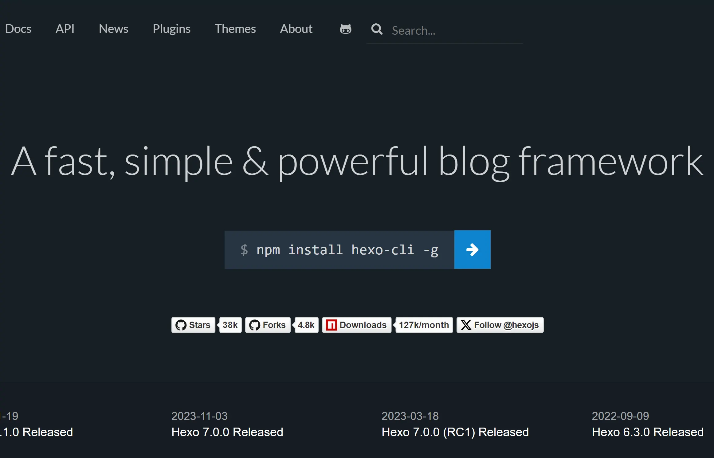

在数字时代，个人博客是分享知识、展示技能和建立个人品牌的重要途径之一。Hexo是一款快速、简洁、强大的静态博客框架，支持自定义主题和插件，可用于快速搭建专业的个人博客网站。<!--more-->本教程将指导如何使用 Hexo 搭建专业的博客网站。



## 安装 Node.js 和 Git

首先，确保您的计算机上已经安装了 Node.js 和 Git。您可以在官方网站下载并安装它们：

- Node.js: https://nodejs.org/
- Git: https://git-scm.com/

## 安装 Hexo

打开命令行界面（例如终端或命令提示符），执行以下命令安装 Hexo：

```bash
pnpm install -g hexo-cli
```

## 创建项目文件夹

在您的电脑任意位置创建一个空的项目文件夹：

```powershell
mkdir thornlog
cd thornlog
```

## 引入 Hexo

在Hexo中，文件夹的组织对于博客的运行至关重要。Hexo文件夹是指定的目标文件夹，所有与博客相关的操作，包括撰写文章、安装主题等，都应在此完成。

请在指定路径新建文件夹（英文名），右键空白处，选择 Git Bash here，输入指令：

```bash
hexo init
```

## 安装主题

Hexo 提供了许多精美的主题供您选择。您可以在 Hexo 官方主题列表 中找到适合您的主题。选择一个主题并安装它，例如：

```powershell
cd your-blog/themes
git clone git@github.com:chen-yingfa/hexo-theme-fengye.git fengye
```

然后在 `_config.yml` 文件中将主题设置为您刚刚安装的主题：

```yml
- theme: some-theme
+ theme: fengye
```

默认该主题配置如下：

```yml
# Header
nav:
  # Home: /index
  Posts: /archives
  # Categories: /category
  # Tags: /tag
  # Publications: /publications  # This renders `source/publications.md`
  # "About Me": /about  # This renders `source/about.md`

email: example@xxx.com

# favicon
favicon: /favicon.ico

# logo
logo: /images/logo.svg

# links 自己修改之后的链接，可根据自己需求修改
links:
  QQ: https://im.qq.com
  Wechat: https://weixin.qq.com/
  ZhiHu: https://www.zhihu.com
  # Twitter:
  # Weibo:

# analytics
google_analytics:
baidu_analytics:

# mathjax
fancybox: true

# mathjax
mathjax: true

# echarts
echarts: true

# busuanzi
busuanzi: true

# mermaid
mermaid:
  enable: true
  # Available themes: default | dark | forest | neutral
  theme: default

# giscus
giscus:
  enable:
  repo:
  repo_id:
  category:
  category_id:
  mapping:
```

##### 添加类别和标签页面：

- 请参阅文件和 。`your-blog/themes/fengye/layout/category.ejs``your-blog/themes/fengye/layout/tag.ejs`

## 配置 Hexo

打开 `_config.yml` 文件，在其中配置您的博客网站信息，包括网站标题、描述、作者等。您也可以配置其他选项，如语言、时区等。

默认`_config.yml`配置修改如下（根据自身需求进行修改）：

```yml
# Hexo Configuration
## Docs: https://hexo.io/docs/configuration.html
## Source: https://github.com/hexojs/hexo/

# Site
title: 记忆秘阁
subtitle:
description: ''
keywords: Thorn Logs,Thorn`刺的个人博客,技术分享,知识扩展,网站搭建,微记录

author: Thorn`刺
language:
- en
- zh-cn
timezone: ''

# URL
## Set your site url here. For example, if you use GitHub Page, set url as 'https://username.github.io/project'
url: https://thorndeva.github.io/
permalink: :year/:month/:day/:title/
permalink_defaults:
pretty_urls:
  trailing_index: true # Set to false to remove trailing 'index.html' from permalinks
  trailing_html: true # Set to false to remove trailing '.html' from permalinks

# Directory
source_dir: source
public_dir: public
tag_dir: tags
archive_dir: archives
category_dir: categories
code_dir: downloads/code
i18n_dir: :lang
skip_render:

# Writing
new_post_name: :title.md # File name of new posts
default_layout: post
titlecase: false # Transform title into titlecase
external_link:
  enable: true # Open external links in new tab
  field: site # Apply to the whole site
  exclude: ''
filename_case: 1
render_drafts: false
post_asset_folder: true
relative_link: false
future: true
highlight:
  enable: true
  line_number: true
  auto_detect: false
  tab_replace: ''
  wrap: true
  hljs: false
prismjs:
  preprocess: true
  line_number: true
  tab_replace: ''

# Home page setting
# path: Root path for your blogs index page. (default = '')
# per_page: Posts displayed per page. (0 = disable pagination)
# order_by: Posts order. (Order by date descending by default)
index_generator:
  path: ''
  per_page: 10
  order_by: -date

# Category & Tag
default_category: uncategorized
category_map:
tag_map:

# Metadata elements
## https://developer.mozilla.org/en-US/docs/Web/HTML/Element/meta
meta_generator: true

# Date / Time format
## Hexo uses Moment.js to parse and display date
## You can customize the date format as defined in
## http://momentjs.com/docs/#/displaying/format/
date_format: YYYY-MM-DD
time_format: HH:mm:ss

## updated_option supports 'mtime', 'date', 'empty'
updated_option: 'mtime'

# Pagination
## Set per_page to 0 to disable pagination
per_page: 10
pagination_dir: page

# Include / Exclude file(s)
## include:/exclude: options only apply to the 'source/' folder
include:
exclude:
ignore:

# Extensions
## Plugins: https://hexo.io/plugins/
## Themes: https://hexo.io/themes/
theme: fengye

# Deployment
## Docs: https://hexo.io/docs/one-command-deployment
deploy:
  type: git
  repo: git@github.com:Thorndeva/Thorndeva.github.io.git
  branch: gh_pages
  message: "Site updated: {{ now('YYYY-MM-DD HH:mm:ss') }}"

email: "sketchupensvray@qq.com"

server_gzip: true

markdown:
  preset: 'default'
  render:
    html: true
    xhtmlOut: false
    breaks: false
    linkify: true
    typographer: false

  anchors:

    # Minimum level for ID creation. (Ex. h2 to h6)
    level: 2

    # A suffix that is prepended to the number given if the ID is repeated.
    collisionSuffix: ''

    # If `true`, creates an anchor tag with a permalink besides the heading.
    permalink: false

    # Class used for the permalink anchor tag.
    permalinkClass: header-anchor

    # Set to 'right' to add permalink after heading
    permalinkSide: 'left'

    # The symbol used to make the permalink
    permalinkSymbol: ¶

    # Transform anchor to (1) lower case; (2) upper case
    case: 0

    # Replace space with a character

    separator: '-'

  plugins:
    - markdown-it-task-lists
    - markdown-it-footnote
    - markdown-it-sup
    - markdown-it-sub
    - markdown-it-ins
    - markdown-it-mark
    - markdown-it-abbr

  # images:
  #   prepend_root: true
  #   post_asset: true

plugins:
  - name: '@renbaoshuo/markdown-it-katex'
    options:
      skipDelimitersCheck: true

html_minifier:
  enable: true
  exclude: []
  ignoreCustomComments: []
  ignoreCustomFragments: []
  collapseWhitespace: true
  removeComments: true
```

主题`_config.fengye.yml`修改配置如下：

```yml
# Header
nav:
  # Home: /index
  Posts:
    path: ./archives
    icon: mingcute:inbox-fill
    show_text: true
  Publications:
    path: ./publications
    icon: mingcute:science-fill
    show_text: true
  # Projects: /projects
  About:
    path: ./about
    icon: mingcute:user-info-fill
    show_text: true
  Categories:
    path: ./category
    icon: mingcute:classify-2-fill
    show_icon: true
  Tags:
    path: ./tag
    icon: mingcute:tag-fill
    show_icon: true
  Home:
    path: /
    icon: mingcute:home-2-fill
    show_icon: true

email: "sketchupensvray@qq.com"

# favicon
favicon: /images/favicon-32x32.png

# Portrait
portrait:

# logo
logo: /images/favicon.ico

# links
links:
  QQ:
    link: https://im.qq.com
    icon: ri:qq-fill
  Wechat:
    link: https://weixin.qq.com
    icon: mdi:wechat
  ZhiHu:
    link: https://www.zhihu.com
    icon: ri:zhihu-line
  # Weibo:

# analytics
google_analytics:
baidu_analytics:

# mathjax
fancybox: true

# mathjax
mathjax: true

# echarts
echarts: true

# busuanzi
busuanzi: false

# mermaid
mermaid:
  enable: true
  # Available themes: default | dark | forest | neutral
  theme: default

# giscus
giscus:
  enable:
  repo:
  repo_id:
  category:
  category_id:
  mapping:

search:
  enable: true
  placeholder:
```

## 创建新文章

现在，您可以开始创建新的博客文章了。在命令行中执行以下命令：

```powershell
hexo new "My New Post"
```

这将在 `source/_posts` 目录中创建一个新的 Markdown 文件，您可以在其中编写文章内容。

## 生成和查看编辑

在完成文章编辑后，执行以下命令生成静态网站：

```powershell
hexo g
```

生成的静态文件将存储在 `public` 目录中。最后，执行以下命令部署网站：

```powershell
hexo s
```

通过以上命令根据您创建的文档进行预览和修改，最终将文档上传至您的仓库。

## 配置 GitHub Pages

1. **创建GitHub仓库**： 登录到您的GitHub账号，点击页面右上角的加号按钮，选择“New repository”来创建一个新的仓库。您可以将仓库命名为 `<username>.github.io`，其中 `<username>` 是您的GitHub用户名。
2. **将Hexo网站推送到GitHub仓库**：这里小白推荐使用Sourcetree，修改整理好文件后一键pull push。

## 配置部署插件

1. **安装Hexo部署插件**： 在命令行中执行以下命令来安装Hexo的GitHub部署插件：

   ```bash
   pnpm install hexo-deployer-git --save
   ```

2. **配置Hexo `_config.yml` 文件**： 打开Hexo项目目录下的 `_config.yml` 文件，在文件末尾添加如下配置：

   ```yml
   type: git
   repo: https://github.com/<username>/<username>.github.io.git
   branch: gh_pages
   ```

   确保将 `<username>` 替换为您的GitHub用户名。

## 部署到 GitHub Pages

现在，您可以通过执行以下命令来生成并部署您的Hexo网站到GitHub Pages：

```bash
hexo g
hexo s
hexo d
```

等待部署完成后，您的博客网站将在GitHub Pages上发布，并可以通过 `<username>.github.io` 访问。

后期如果要更换域名建议要添加以下到域名DNS进行解析：

```powershell
@     A     185.199.111.153
@     A     185.199.110.153
@     A     185.199.109.153
@     A     185.199.108.153
WWW     CNAME      thorndeva.github.io.
```

> 附：DnsLookup：https://mxtoolbox.com/

## 购买域名

选择一个可信赖的域名注册商进行购买。确保注册商提供了良好的客户支持、合理的价格、易于管理域名的控制面板以及良好的用户评价。常见的域名注册商包括但不限于：

- 阿里云
- 腾讯云
- 百度云
- 华为云
- 七牛云
- 又拍云
- 硅云
- ……

## 部署到 Vercel

1. **[登录Vercel账号](https://vercel.com)**
2. **选择创建分支项目**

## 自定义域名（可选）

如果您希望使用自定义域名访问您的Hexo博客，可以在Vercel控制台中配置自定义域名。具体步骤如下：

1. 登录到Vercel控制台：https://vercel.com/dashboard
2. 选择您的项目（即刚刚部署的Hexo网站）
3. 在项目设置中找到"Domains"部分
4. 添加您的自定义域名并保存更改

## 部署到 Cloudflare

首先需要注册一个账号。您可以访问 Cloudflare 的官方网站并按照指示注册一个新账号。其次添加域名到Cloudflare。

1. 登录 Cloudflare 账号后，点击控制面板顶部的 "Add Site" 按钮。
2. 输入您的域名，并点击 "Add Site" 按钮。
3. Cloudflare 将扫描您的域名的 DNS 记录。
4. ……（`根据提示进行后续的操作`）
